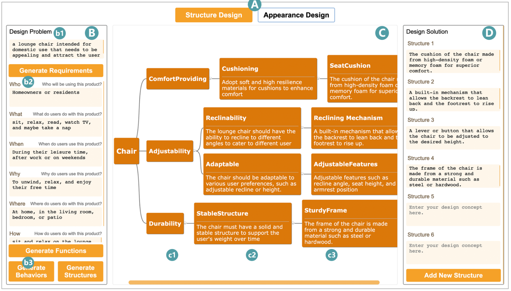
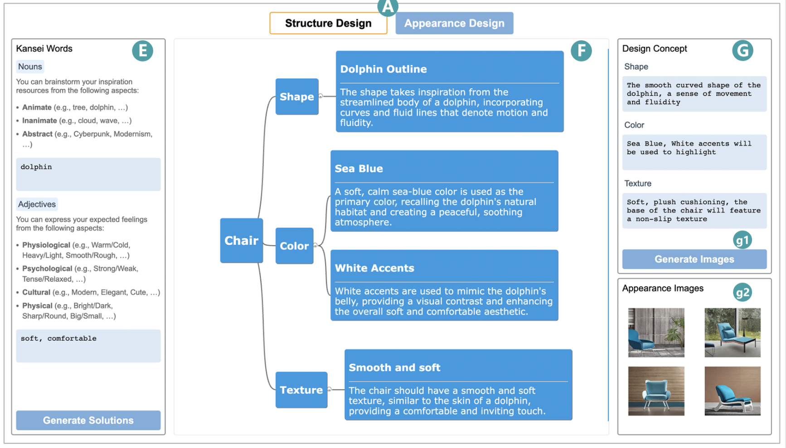
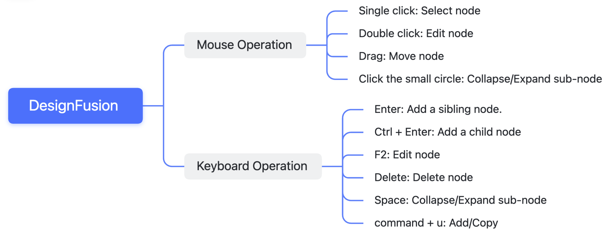

# DesignFusion: Integrating Generative Models for Conceptual Design Enrichment

Conceptual design is a pivotal phase of product development, encompassing user requirement exploration and informed solution generation. Recent generative models with their powerful content generation capabilities have been applied to conceptual design tasks to support designers’ ideation. However, the lack of transparency in their generation process and the shallow nature of their generated solutions constrain their performance in complex conceptual design tasks. In this study, we first introduce a conceptual design generation framework based on Large Language Models (LLMs) and Text-to-image Models. This framework decomposes the conceptual design task based on design process and design attributes, employing multi-step reasoning to generate structure and appearance design for products. Then we present an interactive system, DesignFusion, empowering designers to trace the generation process and control inputs/outputs at each reasoning step.






# Running a Simulation

```shell
python manage.py runserver
```



